<div align="center">

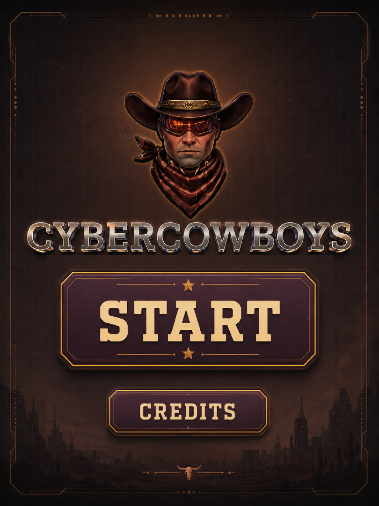

# 🤠 CyberCowboys

### An enhanced horse-riding experience for Snap Spectacles

*Visualizing English riding lessons in augmented reality — built on the idea that some lessons are better felt and seen than spoken.*

[](https://www.spectacles.com/)
[](https://ar.snap.com/lens-studio)
[](https://cybercowboys-back.fly.dev)
[]()

</div>

---

## 🌵 The story behind it

After volunteering in assistive **equine therapy** sessions, we noticed something. Some riders with disabilities have a hard time receiving *verbal* instructions, but respond better to tactile and visual instructions. Snap Spectacles is the technology we use in Cybercowboys to **communicate beyond words**.

**CyberCowboys** is an augmented-reality riding experience where horse-riding lessons become something you can *see* laid out on the real arena floor in front of you. From elementary basic commands all the way up to advanced jumping courses.

---

## ✨ What it does

- 🎚️ **Lessons across four levels** — novice, elementary, intermediate, and advanced English riding lessons.
- 🏗️ **Design your own arena** — place cones, poles, barrels, jump fences, cavaletti, stop zones, number tags, and start/finish lines, then draw the path the horse should follow.
- 💾 **Save & reload** — store your arena arrangements and pull them back up to practice later.
- 🥽 **See it in AR** — the course renders as 3D obstacles and a glowing path on the real ground through Spectacles.
- 🎯 **Calibration mode** — rotate, scale, and move the virtual arena so it lines up with your *actual* riding arena.
- 🔄 **Live & real-time** — edits made on the web update inside Spectacles within about a second, over WebSocket.

> 🔮 **On the roadmap:** multi-player sessions, so instructor and rider (and friends) can share the same arena.

---

## 🆕 New in this version

The big shift: **you no longer have to turn to the WebView to control the lesson.** The controls that mattered moved into AR as native panels and buttons, and the Lens learned to watch the rider rather than just draw the floor.

### 🐎 The Lens now watches the rider

- 👣 **Step prediction** — your head dips once per stride at heel strike. The Lens finds those troughs, works out your cadence, combines it with your smoothed velocity, and drops **four markers where your next four footfalls will land**. Each marker can carry its own colour, so how far ahead a guess is — and how much less it's worth trusting — reads at a glance. They hide below a walking pace so they don't pile up under you when you stand still.
- 🔵 **Wearer dot** — a marker rides the floor beneath your feet, smoothed so it doesn't copy the nervous sway of head tracking.
- ⏱️ **Stop zones that actually stop you** — stand on a stop decal and the floating label counts **5-4-3-2-1 and finishes on GO** with a chime. Step off early and it resets. While you're holding, the label slides forward so the countdown isn't sitting on your nose.
- 🔢 **Number tags at sight level** — `number_tag` values render as floating text at eye height instead of on the floor, billboarded to you and gently bobbing, so you read the course without looking down.
- 📊 **Speed readout** — live m/s, km/h, or mph, from head displacement.

### 🎛️ Controls moved into AR

- 📚 **Choose Lesson, in-world** — a floating panel with lessons grouped by level under gold section headers, one card per lesson showing thumbnail, tag, name, and point/obstacle counts. Layout is specified in real-world centimetres, so it's the same size on every device.
- 🔢 **Arena ID editing** — every arena has a code shown top-right as `0000-1234`. The Edit button opens the Spectacles **system number pad** pre-filled with the current code; type a new one and the glasses follow that arena's main session. Codes `0000-0001` through `0000-0999` are a reserved band for read-only saved courses.
- ♻️ **Regenerate code** — mint a brand-new arena and session without touching the web page.
- 🔄 **Change Direction** — flips the course to its **mirror image**, reflected about its own centre line, so you can ride the same pattern on the opposite rein. It's its own inverse. Crucially this now runs **server-side**, so the designer's page and the glasses always agree and a rider flipping the course is visible to the person at the computer. (The old version toggled a private view flag inside the Lens, which reflected about the *rider* while the website reflected about the *layout's* centre line — anything off-centre jumped across the arena in AR and stayed put on the web.)
- ℹ️ **Info panels** — one shared panel whose text and image are supplied by whichever button opened it, so two buttons can never race each other over the panel's state.

### 🎨 Better-looking courses

- 🌈 **Colour-coded paths** — waypoints render in blue, green, yellow, or red, matching the swatches in the web designer. Extra colours can be added straight from the Inspector without touching code.
- ➰ **Continuous path lines** — extra dots are interpolated between stored waypoints so a course reads as one flowing line rather than a row of separate markers.
- 🔍 **Prefab audit** — on the first path draw, the Lens checks that your four colour prefabs are genuinely different assets and shouts if they're renamed clones of the blue one. This is the single most common setup mistake and it used to look like a code bug.

### 📡 It survives bad arena wifi

Everything here exists because the network is the one part of this system nobody controls. On a good connection, none of it fires.

- Snapshot requests are **coalesced**, so a burst of triggers becomes one pull instead of four.
- Reconnects use **exponential backoff with jitter**, capped, so a downed server isn't hammered every three seconds by every pair of glasses in the room.
- **Half-open sockets** are abandoned after a connect timeout and retried — otherwise the Lens waits forever with them.
- Presses made while the link is down **queue in an outbox** and replay in order on reconnect, instead of vanishing silently.
- Snapshots are **fingerprinted**, so a rebroadcast of data already on the floor costs nothing.
- An optional label reports **CONNECTING / LIVE / OFFLINE**. On a slow network, the difference between "still loading" and "broken" is the whole of the rider's experience.

---

## 🎬 See it in action

### 🎯 Setting up

Look at the floor and hold steady — the ring fills and the arena lands on the real ground, measured rather than guessed. Then switch to calibration mode to rotate and scale the virtual arena until it sits exactly on your real one.

| Calibrating the floor | Rotate & scale to your arena |
|:--:|:--:|
| 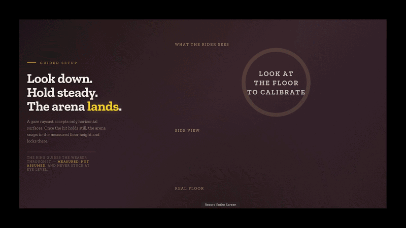 | 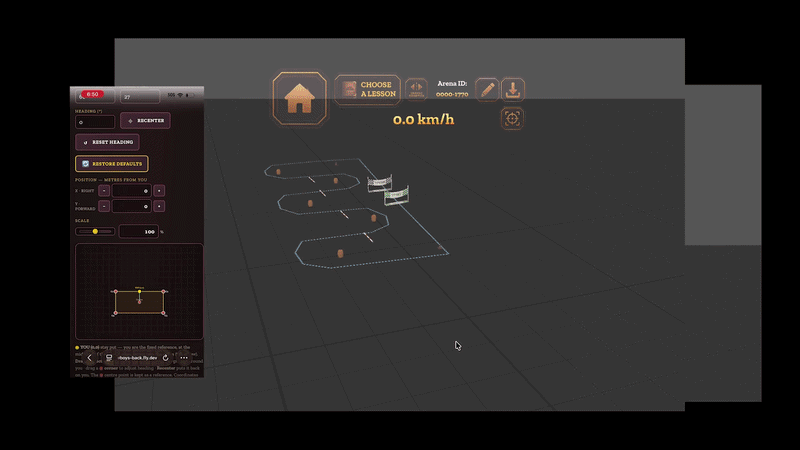 |

### 📚 Choosing a lesson

Lessons are grouped by level under gold section headers, each card showing thumbnail, tag, name, and point and obstacle counts. Change your mind and the whole floor clears and rebuilds — no resetting poles, no walking the course.

| Choosing a lesson | Switching to another |
|:--:|:--:|
| 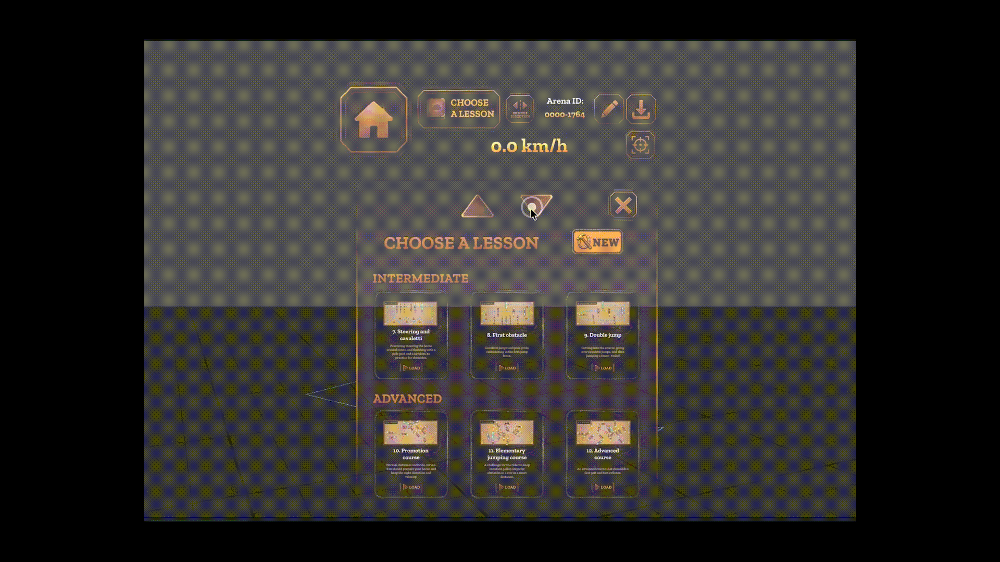 | 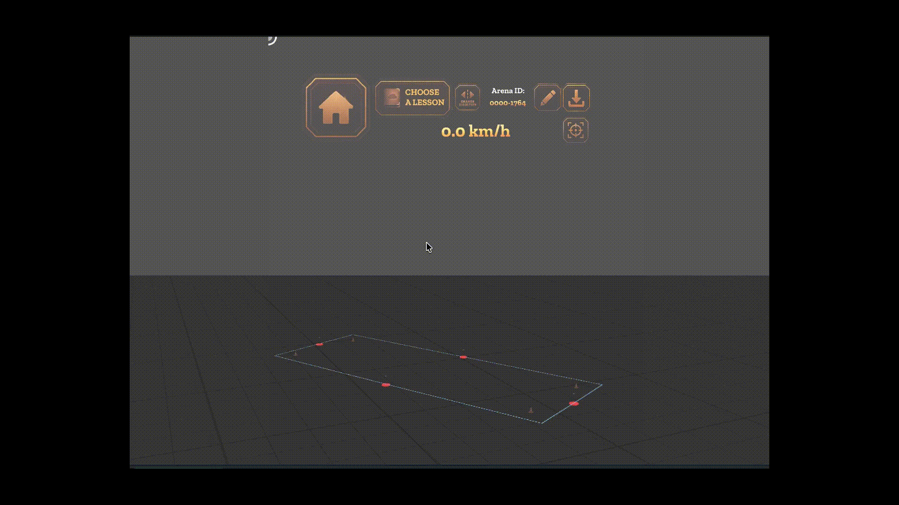 |

### 🐎 Riding it

A cowboy marks where you are. Ahead of him, four markers show where your next four footfalls will land — your head dips once per stride when your heel strikes, and the Lens reads that rhythm to work out your cadence. **Change Hand** mirrors the course about its own centre line, so you can ride the same pattern on the opposite rein.

| The cowboy predicts your next steps | Change hand — the mirror image |
|:--:|:--:|
| 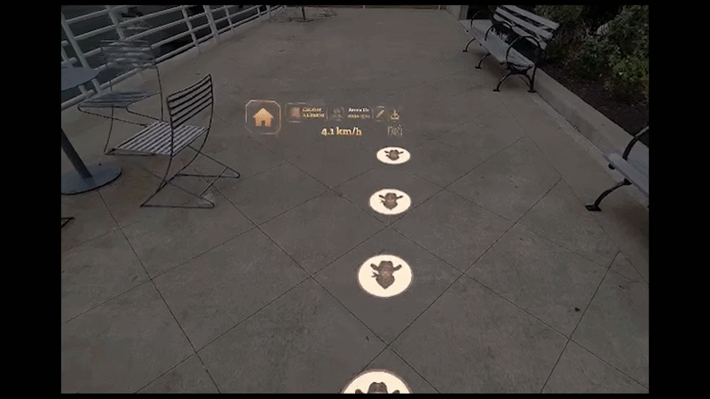 | 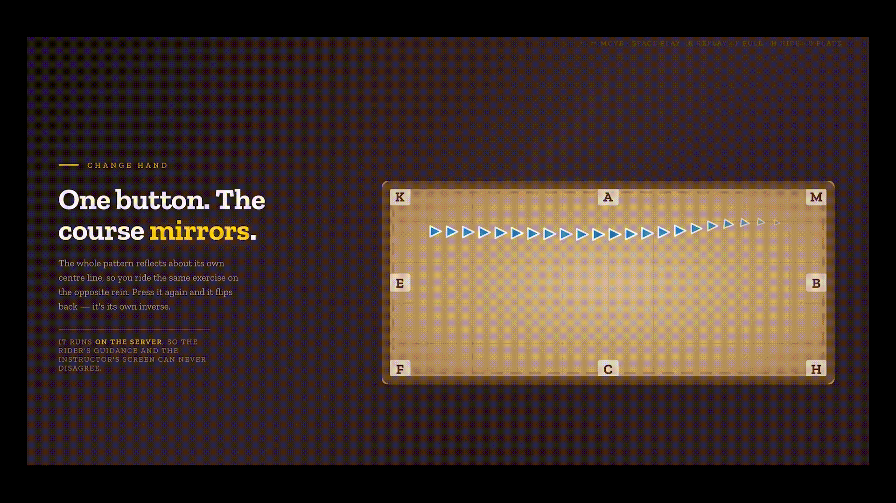 |

### 🌐 Building and sharing an arena

Anyone can build a lesson in the browser — drop obstacles, draw the path, delete and reposition as you go. Every arena carries a code. Type that code into the Spectacles and you're in the same arena: what they build, you ride, as they build it.

| Creating a lesson on the web | Picking one, with the arena ID | Joining from the Spectacles |
|:--:|:--:|:--:|
| 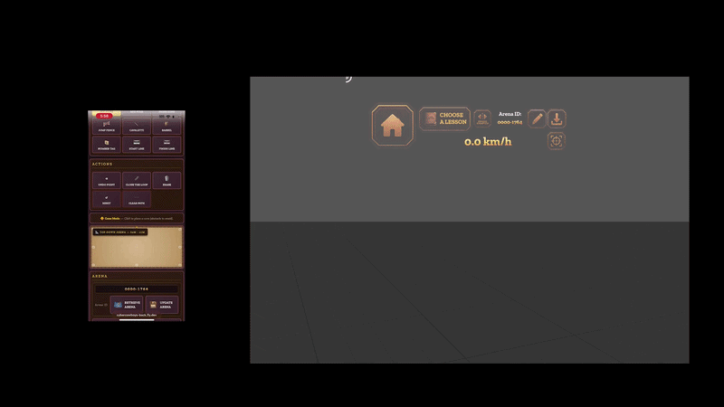 | 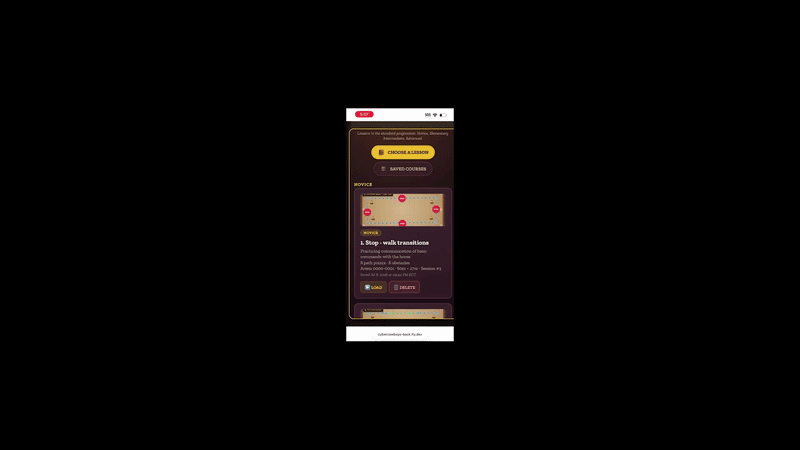 | 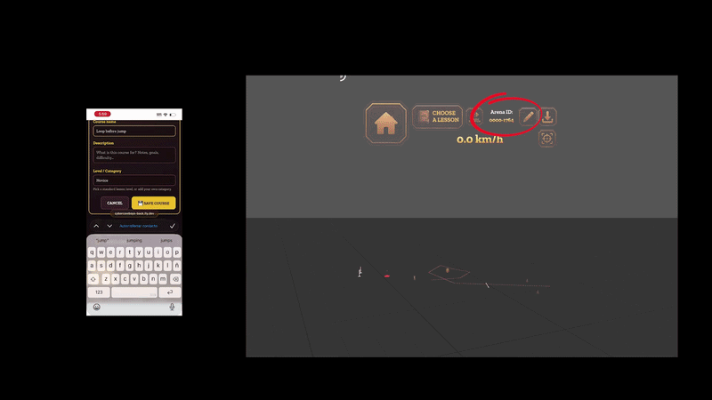 |

---

## 🖼️ Gallery

### The arena, live through Spectacles
Pick or design an arena and the 3D assets appear behind you on the real ground — obstacles, path markers, and all.

<p align="center">
  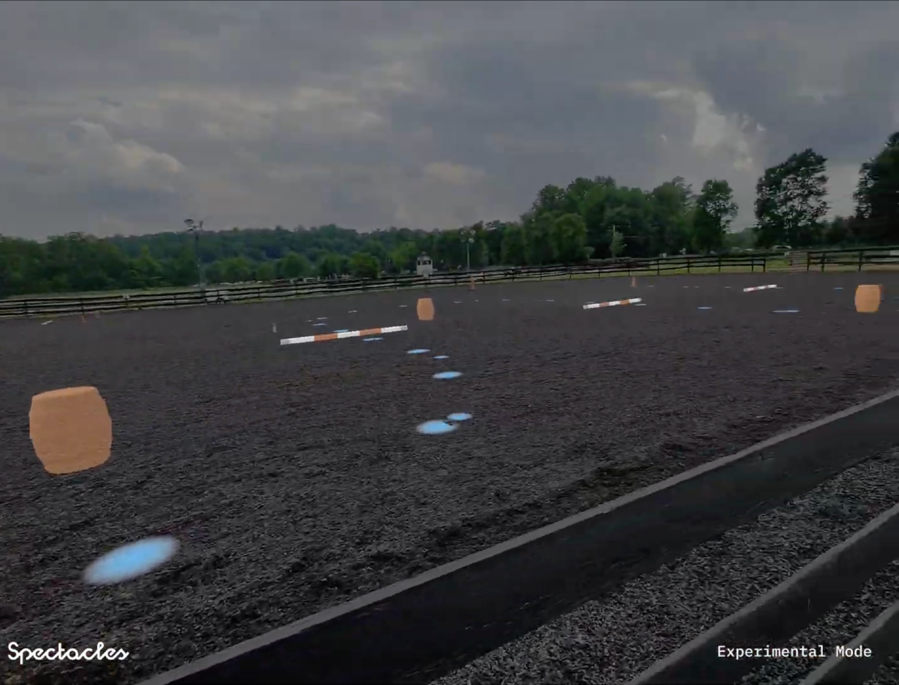
  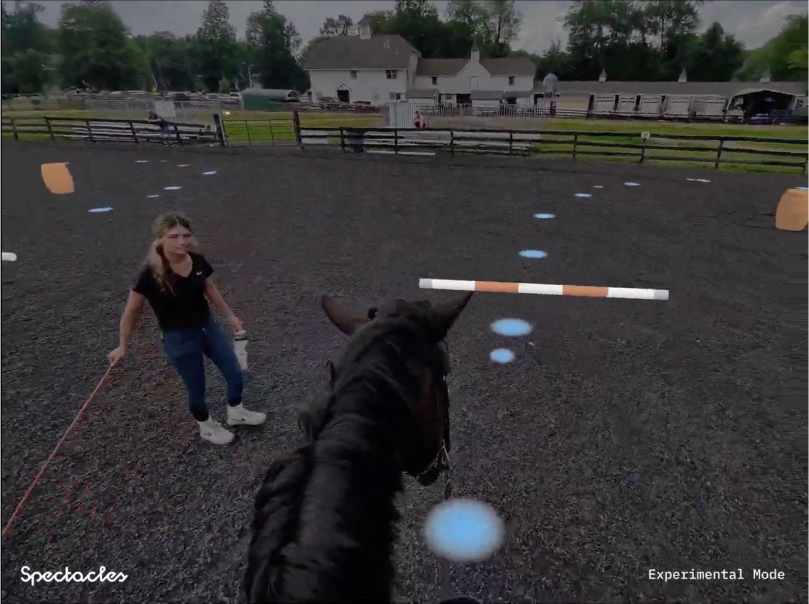
  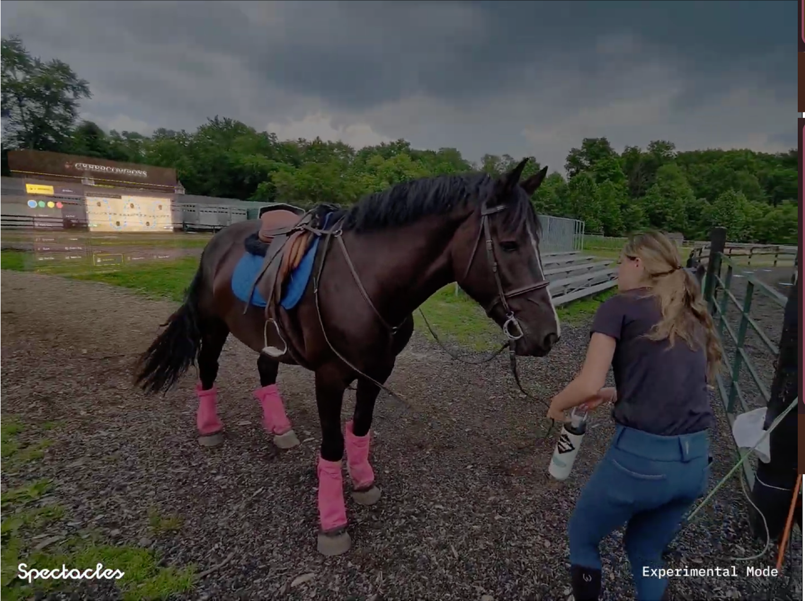
</p>

### The web designer
Build a course from scratch or load a lesson, all from the browser. Works inside the Spectacles WebView, on a phone, or on a computer.

<p align="center">
  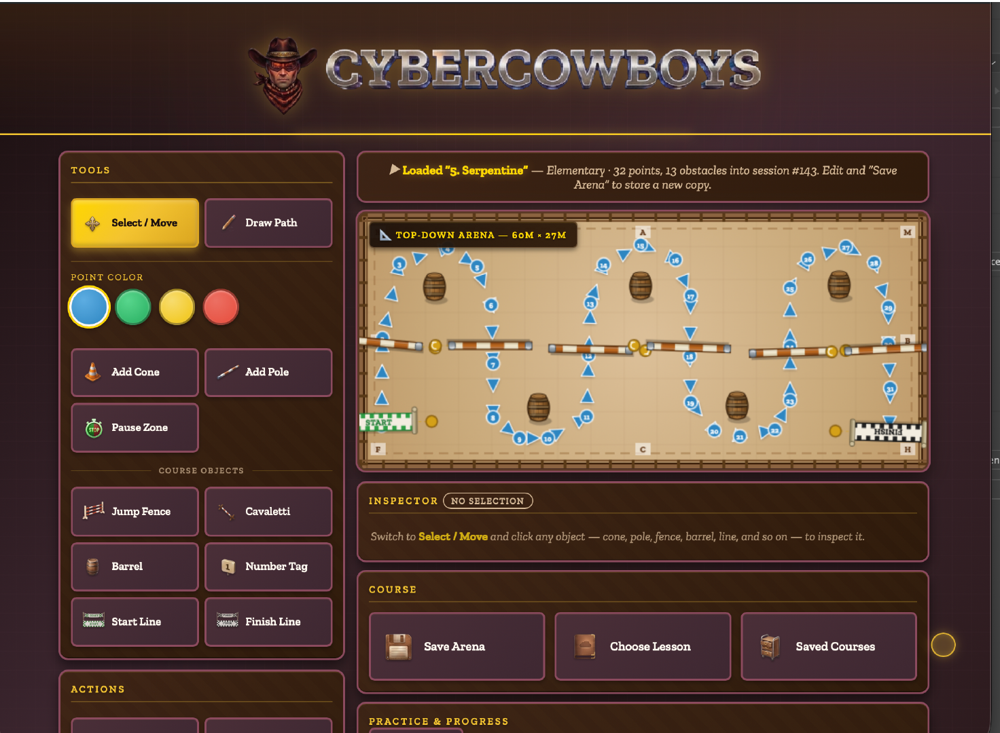
</p>

### The lesson library
Ready-made courses spanning novice and elementary levels — from stop-walk transitions to serpentines and pole grids. Browsable from the web designer or from the in-AR Choose Lesson panel.

<p align="center">
  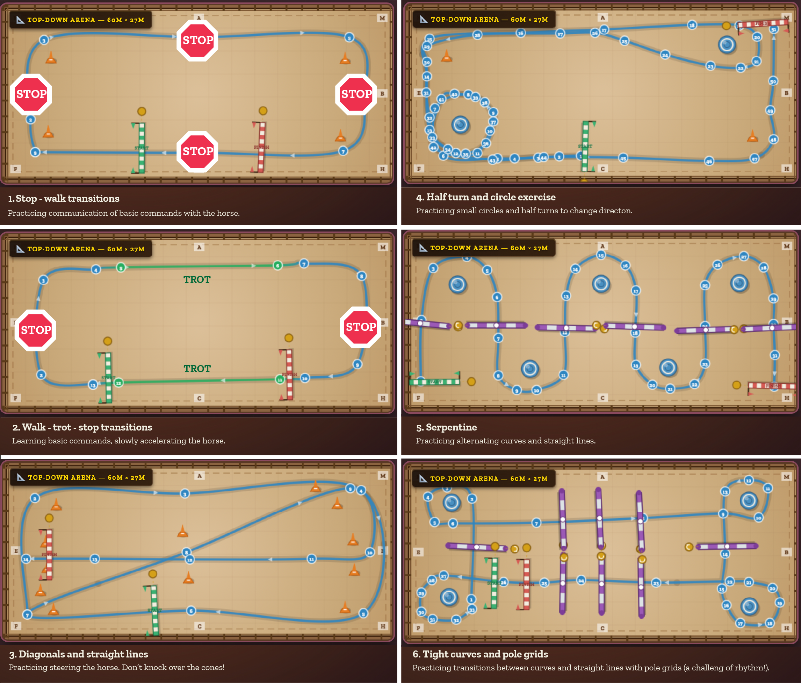
</p>

### Calibration mode
Set your arena's real dimensions and heading; the page sends calibrated coordinates straight to Lens Studio.

<p align="center">
  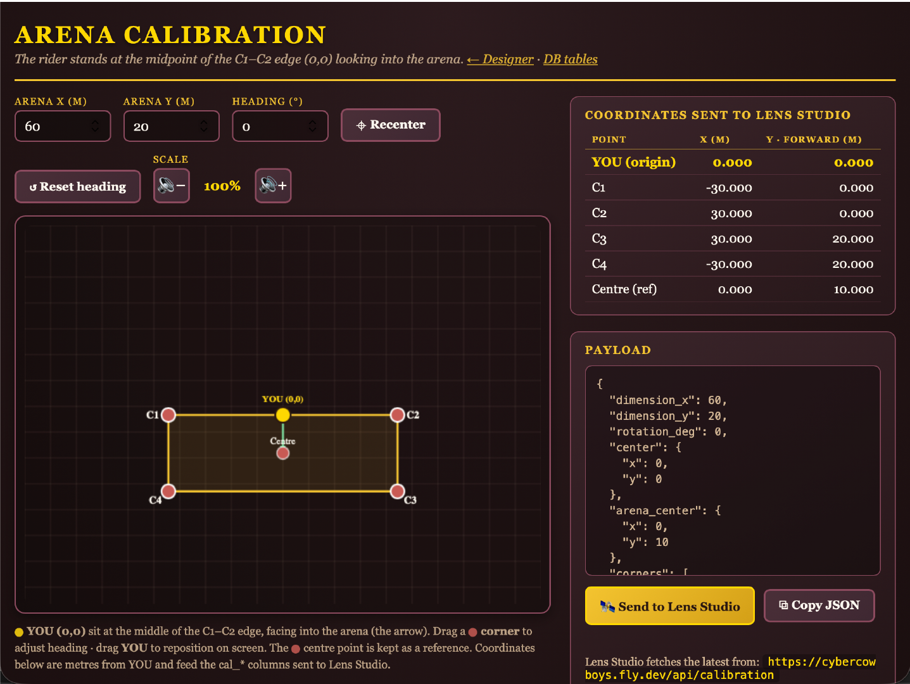
</p>

---

## 🏗️ How it's built

CyberCowboys has two halves that talk to each other in real time.

```
  ┌─────────────────────────────┐         WebSocket          ┌──────────────────────────────┐
  │  cybercowboys-back.fly.dev  │ ──── live DB snapshots ──▶ │  Spectacles Lens (this repo) │
  │                             │                            │                              │
  │                             │ ◀── arena edits, cal ───   │  • WebView (shows the site)  │
  │  • HTML / CSS / vanilla JS  │                            │  • ArenaStreamerTyped (3D)   │
  │  • Node.js + WebSocket      │                            │  • FloorPlacer / Surface     │
  │  • SQLite (11 tables)       │                            │    Detection (ground plane)  │
  │                             │                            │  • StartMenu (front screen)  │
  │  Designer · Lessons ·       │                            │  • In-AR panels & buttons    │
  │  Calibration · DB viewer    │                            │  • SIK interactions          │
  └─────────────────────────────┘                            └──────────────────────────────┘
```

The server is the **single source of truth**. The Lens holds no course state of its own — it subscribes to table snapshots and rebuilds the floor whenever one differs from the last it drew. Anything that *changes* the course (Start, Regenerate, Change Direction, Load Lesson) is sent to the server as a message; the server rewrites the rows, recomputes the calibrated columns through the normal pipeline, and broadcasts the result to everyone in the arena. That's why the same operation is correct on the web page and in the glasses — it's literally the same server function in both cases.

### The web app
A website made with **HTML, CSS, and vanilla JavaScript**, a **Node.js** backend, and **SQLite** for storage, hosted on **Fly.io** at [cybercowboys-back.fly.dev](https://cybercowboys-back.fly.dev). Real-time communication runs over a **WebSocket** so any change to the database is pushed straight out to connected clients.

The database holds everything about a session — obstacles, the drawn path, arena dimensions, calibration, and the saved-course library:

<p align="center">
  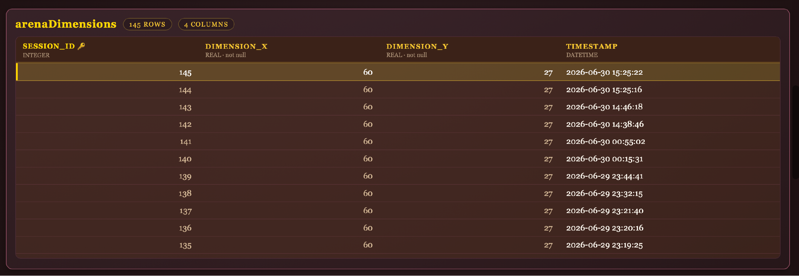
  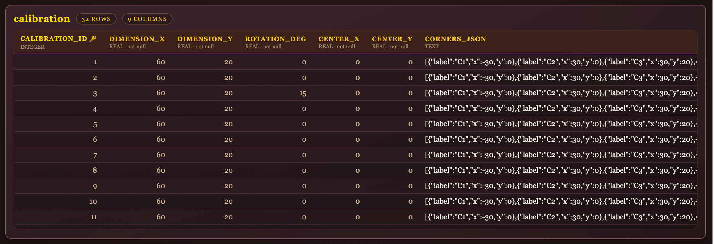
</p>
<p align="center">
  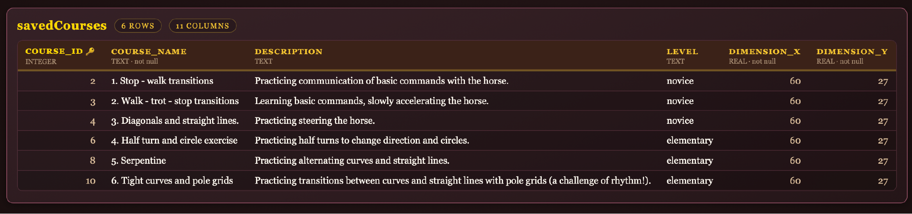
  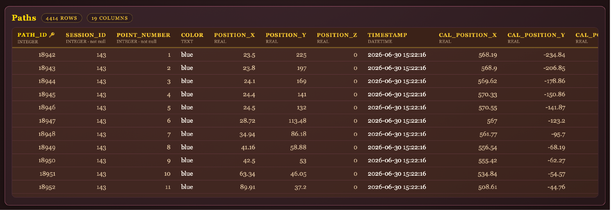
</p>

### The Spectacles Lens
A Lens Studio project that renders the arena in AR. Its TypeScript components:

| Script | What it does |
|---|---|
| `ArenaStreamerTyped.ts` | **The core.** Connects to the Fly.io WebSocket, subscribes to the live DB, and lays every obstacle and path point on the floor under `arenaRoot`. Also owns stop zones, number tags, the wearer dot, step prediction, the arena ID label, and the whole reconnect/outbox layer. |
| `FloorPlacer.ts` | Keeps the arena pinned to the **real floor** (instant assumed-floor, then look-to-confirm on device). Pinch the ground to recenter. |
| `SurfaceDetection.ts` / `CircleAnimation.ts` | Path-Pioneer-style ground-plane detection with the look-and-hold ring. |
| `StartMenu.ts` | The front screen — Start / Credits / Home — and shows, hides, and reloads the WebView. |
| `ChooseLessonMenuTyped.ts` | The in-AR lesson browser: panel, section headers, and card layout in real-world centimetres. |
| `CalibrateMenuTyped.ts` | A minimal panel showing just the arena code the glasses are currently tracking. |
| `InfoPanelTyped.ts` / `InfoPanelButtonTyped.ts` | One shared info panel; each opener button carries its own text and image. |
| `ArenaIdEditorTyped.ts` | Opens the Spectacles system keyboard to retarget the Lens at a different arena code. |
| `RegenerateCodeButtonTyped.ts` / `StartArenaButtonTyped.ts` | Mint a fresh arena + session on the server. |
| `ChangeDirectionButtonTyped.ts` | Asks the server to mirror the course about its own centre line. |
| `SpeedReadoutTyped.ts` | Live speed HUD from head displacement. |
| `RefreshButtonTyped.ts` | Forces a fresh pull of all DB snapshots from a pinch button. |
| `WebViewReload.ts` | Reloads the embedded website when its button is pinched. |

**Coordinate mapping:** the rider stands at the midpoint of the arena's top edge `(0,0)` looking in; `+x` is right and `+y` is forward into the arena. The Lens mirrors the server's pixel→metre transform exactly, so the AR layout matches the web designer one-to-one. (World units in Lens Studio are centimetres — 1 m = 100 units.)

### Using it with Spectacles
When you wear the Spectacles, the **WebView floats in front of you** and the **arena builds behind you**. Pick or design an arena on the WebView, then turn around to see the 3D course on the real ground. Or skip the WebView entirely and drive the whole lesson from the in-AR panels — Choose Lesson, Edit code, Change Direction, Regenerate. Switch to **calibration mode** to rotate, scale, and slide the virtual arena until it sits exactly on your real one.

---

## 📦 Tech stack

| Layer | Technology |
|---|---|
| AR runtime | Snap **Spectacles** · **Lens Studio 5.23.2** (Experimental API) |
| Lens packages | Spectacles Interaction Kit · WebView |
| Lens scripting | TypeScript |
| Web frontend | HTML · CSS · vanilla JavaScript |
| Web backend | Node.js · WebSocket |
| Database | SQLite |
| Hosting | Fly.io — [cybercowboys-back.fly.dev](https://cybercowboys-back.fly.dev) |

> **Note:** Spectacles UIKit was removed. Nothing in the project references it, and versions built before the Lens API 372 update fail to compile — `vec2` gained a `setXY()` method that `vec3` doesn't have, which exposes a latent type bug inside the package.

---

## 🚀 Getting started

### Try the web app
Just open **[cybercowboys-back.fly.dev](https://cybercowboys-back.fly.dev)** in any browser — on a computer, a phone, or inside the Spectacles WebView. Pick a lesson or design your own arena.

- 🎨 **Designer** — build and edit a course
- 📚 **Choose Lesson** — load one of the pre-made lessons
- 🎯 **Calibration** — set your arena dimensions and heading
- 🗄️ **DB tables** — inspect the live database

### Run the Lens
1. Install **Lens Studio 5.23.2+** (or 5.15.4 if you're targeting Spectacles 2024 — see Version notes).
2. Open this project (`Spectacles-Cybercowboys *.esproj`).
3. Make sure the **Experimental API** flag is enabled (this Lens uses it for ground classification).
4. The `ArenaStreamerTyped` component's `websocketUrl` should point at `wss://cybercowboys-back.fly.dev/`.
5. Select `GameRoot/ArenaRoot` and check the Inspector — every obstacle and path prefab slot should be filled, and **the four path colour slots must be four genuinely distinct prefabs**, not renamed copies.
6. Assign the Zilla Slab font asset to `numberTagFont`.
7. Push to your Spectacles, press **Start**, and turn around to see the arena.

> Tip: the streamer's `arenaScale` input shrinks the whole 60 m × 20 m arena to fit a room or tabletop for testing (e.g. `0.1`).

### Dials worth knowing

| Input | Default | What it does |
|---|---|---|
| `arenaScale` | `1.0` | Master size dial for the whole course |
| `startFinishLineExtraScale` | `10.0` | Extra multiplier for start/finish lines only |
| `triangleSizeMeters` | `0.75` | Path dot diameter |
| `groundOffsetCm` | `0.8` | Lift above the floor to avoid z-fighting |
| `stopHoldSeconds` | `5` | How long you must stand on a stop sign |
| `stepMinSpeedMps` | `0.4` | Below this, step markers hide |
| `stepBobThresholdCm` | `0.5` | How deep a head dip counts as a footfall |
| `targetSession` | `0` | `0` means newest session |

---

## 📁 Repository structure

```
.
├── Assets/
│   ├── ArenaStreamerTyped.ts     # live arena ← WebSocket, obstacles, paths,
│   │                             #   stop zones, step prediction, resilience
│   ├── FloorPlacer.ts            # pin arena to the real floor
│   ├── StartMenu.ts              # front screen + WebView control
│   ├── ChooseLessonMenuTyped.ts  # in-AR lesson browser
│   ├── ArenaIdEditorTyped.ts     # system keyboard arena code entry
│   ├── InfoPanelTyped.ts         # shared info panel
│   ├── SpeedReadoutTyped.ts      # speed HUD
│   ├── SurfaceDetection/         # ground-plane detection
│   └── ...                       # prefabs, materials, 3D models, textures
├── Packages/                     # SIK · WebView
└── docs/
    ├── images/                   # screenshots used in this README
    └── gifs/                     # riding / calibrating / creating / picking
```

---

## 🩹 Known issues

- **Missing FBX textures.** `stop-base` and `wooden-barrel` reference `Stop Base.fbm` and `Wooden Barrel.fbm` texture folders that aren't in the project, so both render untextured.
- `unsupported inheritance type` warnings on import for `Traffic_Cone`, `SM_Traffic_Cones_Low`, `StopBase`, and `Barrel` are cosmetic — the meshes come in fine.
- `Image ... resized to 1x1` log lines are expected. Those are constant-value normal and metallic maps from the OBJ exports.

---

## 🔧 Version notes

Originally built in **Lens Studio 5.15.4** (Lens API 330, client 13.60) for **Spectacles (2024)**. Migrated to **5.23.2** (Lens API 372, client 14.16) for **SPECS 27**.

Snap's 5.15.x line is the last for Spectacles (2024), and 5.2x targets SPECS 27 — so the two are separate forks and the migration is one-way. Keep a 5.15.4 install alongside if you still ship to the older hardware.

The migration renamed six shaders from `.ss_graph` to `.graphShader`, swapped the `Font` field for `FontSource` on 17 text components, and replaced light `DecayType`/`DecayRange` with `FalloffType`/`FalloffRange`/`ShadowType`. No script or script metadata changed.

---

## 👥 Credits

Made with grit and good intentions by the **CyberCowboys** team — born out of volunteering in assistive equine therapy, and a belief that we can communicate beyond words.

🐴 *Yeehaw.*
